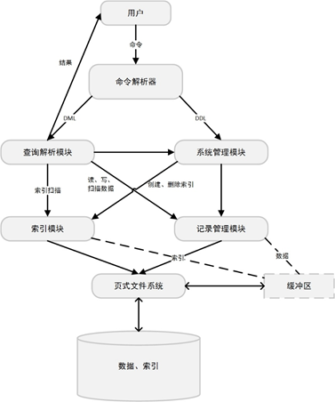
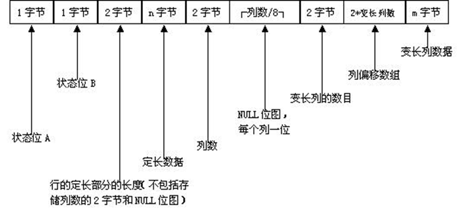
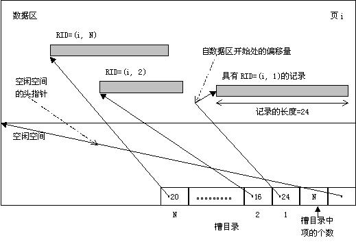
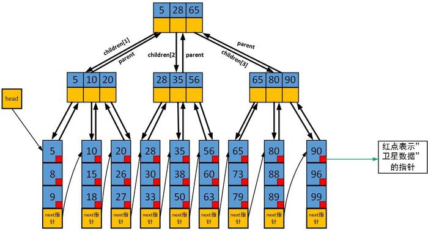

# 数据库项目文档

2015011343 陈宇

2015011337 季智成

---

<!-- TOC -->

- [数据库项目文档](#数据库项目文档)
    - [实现的功能](#实现的功能)
    - [系统结构设计](#系统结构设计)
    - [主要模块设计原理](#主要模块设计原理)
        - [基础数据类型](#基础数据类型)
        - [文件系统](#文件系统)
        - [记录管理模块](#记录管理模块)
            - [数据库/数据表结构定义](#数据库数据表结构定义)
            - [数据储存与序列化](#数据储存与序列化)
            - [记录存储方式](#记录存储方式)
        - [索引模块](#索引模块)
            - [变长数组文件系统](#变长数组文件系统)
            - [B+树索引](#b树索引)
            - [散列索引](#散列索引)
        - [查询解析模块](#查询解析模块)
        - [系统管理模块](#系统管理模块)
            - [创建](#创建)
            - [*数据类型转换](#数据类型转换)
            - [插入](#插入)
            - [删除](#删除)
            - [更新](#更新)
            - [查询](#查询)
            - [*查询优化](#查询优化)
            - [*其他](#其他)
        - [UI模块](#ui模块)
    - [小组分工](#小组分工)
    - [参考文献](#参考文献)
    - [项目源码](#项目源码)
        - [github仓库地址](#github仓库地址)
        - [目录说明](#目录说明)
        - [环境安装](#环境安装)
        - [编译与运行](#编译与运行)
        - [GUI运行说明](#gui运行说明)

<!-- /TOC -->

---

## 实现的功能

* 基本功能：数据的增删查改，创建和删除数据库和数据表

* 索引：B+树索引，唯一键值hash，复键值hash

* 查询优化：对于单表查询使用已有索引进行估价，对于多表查询使用拓扑排序确定一个最佳的查询顺序，对于外键和主键有优化

* 外键约束：插入时检查外键是否存在，删除时一并删除相关联的数据

* 支持多种类型：
  1. #define INT_TYPE ("int")  
  2. #define CHAR_TYPE ("char")  
  3. #define VARCHAR_TYPE ("varchar")  
  4. #define DATE_TYPE ("date") // DATE储存为time_t
  5. #define FLOAT_TYPE ("float")  
  6. #define DECIMAL_TYPE ("decimal") // 定点数，两个int，9位  

* 支持三个或以上表的连接：对于有外键约束的查询有优化

* 聚集查询：支持AVG,SUM,MIN,MAX,COUNT

* 模糊查询：转化为正则表达式判断

* 散列索引：对主键建有两种类似的hash索引

* 属性域约束：会在插入和修改数据的时候检查值是否符合要求

* GUI：实现了web版本的GUI

## 系统结构设计



## 主要模块设计原理

### 基础数据类型

在系统设计中，为了性能和易用性考虑，在代码中大量使用了C++11的`shared_ptr`，由此可以不用担心拷贝时的高复杂度和内存泄露，如下：

```c++
// 页式文件
class File
{
public:
    typedef shared_ptr<File> ptr;
};
```

并且，在系统中有很多地方需要将数据序列化为二进制数据，并且还需要记录数据的长度，所以考虑用`vector`和`unsigned char`组合来实现：

```c++
typedef shared_ptr<vector<uint8>> data_t;

bool equals(data_t a, data_t b);
data_t alloc_data(int size);
data_t clone(data_t data);
data_t int_data(int value);
data_t float_data(float value);
data_t string_data(string str);
data_t time_data(time_t value);
```

这里定义的`data_t`是系统中很多进行数据交互的类型，包括将记录序列化为二进制数据和索引储存的`key`和`value`。

### 文件系统

由于在项目的某些设计中对页式文件系统有一些特殊的要求，所以并没有使用课程推荐的页式文件系统，而是自己实现了一个简单的版本。

主要功能来说，以8K的单位进行读写，并且会将数据缓存到内存中，在必要时将修改过的数据写会到磁盘上：

```c++
// disk/file.h
// 页式文件
class File
{
public:
    File(string filename);
    ~File();

    // 重置下一页
    void ResetNextPage(int page = 0);

    // 读取一页，若该页不存在则返回全0的数据
    data_t ReadPage(int page, bool read_only = false);

    // 读取下一页，若该页不存在则返回全0的数据
    data_t NextPage(bool read_only = false);

    // 新页，在最后
    data_t NewPage(bool read_only = false);

    // 返回当前页
    int CurrentPage();

    // 是否结束
    bool End();

    void MarkDirty(int page);

    void Flush();
};
```

此外，还添加了很多和磁盘交互的接口，比如创建文件夹等：

```c++
void mkdirp(const string& path);
void mkfile(const string& filepath);
void rmdir(const string& path);
void rmfile(const string& filepath);
void cpfile(const string& src, const string& dst);
bool exists(const string& path);
int filesize(const string& filepath);
vector<string> listdir(const string& path);

string path_join(const string& a, const string& b);
string get_cwd();
```

### 记录管理模块

#### 数据库/数据表结构定义

在本系统的设计中， **一个数据库对应与一个文件夹，同一个数据库中的所有数据都储存在此文件夹中** 。在该目录下，存在一个`ddf.json`的文件，此文件以JSON个是记录了该数据库的所以结构信息，包括有哪些表，每个表有哪些列及其类型，每个表有哪些主键以及外键约束。

比如，描述一个列需要记录的信息如下：

```c++
// ddf/coldesc.h
// 列描述类
class ColDesc
{
public:
    TableDesc* td;

    string columnName;
    string typeName; // 小写
    size_t length; // 长度，对于某些类型时长度限制(varchar)，对于某些类型时指定长度(char)，对于int等定长数据应该恒为1
    size_t display_length; // 展示的长度，对int有效
    bool allow_null;
    bool indexed;
    bool is_oneof_primary;
    bool is_foreign_key;
    string foreign_tb_name;
    string foreign_col_name;
    vector<Json> scope_values;
};
```

这些信息应该在创建数据库之后，插入数据之前确定好， **由于每个记录被序列化的结果与表结构相关，所以原则上不允许一个表在有数据的情况下修改表结构（添加列等）。**

序列化之时，每个列描述为一个`Json`对象，每个表描述为一个`Json`数组，每个数据库描述为一个`Json`数组，最终将数据库的结果写入`ddf.json`即可。

在`ddf/typeinfo.h`中，还定义了目前数据库可以支持的数据类型，以及不同数据类型的表现（是否定长，数据大小等）：

```c++
// ddf/typeinfo.h
#define INT_TYPE ("int")
#define CHAR_TYPE ("char")
#define VARCHAR_TYPE ("varchar")
#define DATE_TYPE ("date") // DATE储存为int
#define FLOAT_TYPE ("float")
#define DECIMAL_TYPE ("decimal") // 定点数，两个int，9位

enum type_t {
    INT_ENUM = 0,
    CHAR_ENUM,
    VARCHAR_ENUM,
    DATE_ENUM,
    FLOAT_ENUM,
    DECIMAL_ENUM,
};

size_t type_size(const string& typeName); // 该类型单个元素的大小
bool is_type_fixed(const string& typeName); // 是否是定长类型
type_t type_enum(const string& typeName);
string type_name(type_t type_enum);
```

**在系统中，不管是何种类型，统计储存为上文中的`data_t`，然后再通过`type_t`标识其类型** ，这样做的好处是在很多与具体类型无关的地方（比如索引中），可以忽略掉数据类型而只用关注与`data_t`其二进制数据本身。

同时，也配套定义了相关处理函数：

```c++
// ddf/typeinfo.h
size_t type_size(const string& typeName); // 该类型单个元素的大小
bool is_type_fixed(const string& typeName); // 是否是定长类型
type_t type_enum(const string& typeName);
string type_name(type_t type_enum);

// return a - b;
int compare(type_t type, data_t data_a, data_t data_b);

// 序列化为可以输出的内容
string stringify(type_t type, data_t data);
```

#### 数据储存与序列化

考虑到存在数据的时候其表结构不会改变，所以可以对应与表结构，用一个数组储存每列的之，即：第0列的数据储存在数组第0个位置，第1列的数据储存在数组第1个位置。

在系统中，一个记录用一个`Record`表示：

```c++
// ddf/record.h
// 描诉一个记录
// 注意：使用Record的时候要求td指向的TableDescription对象必须存在，不能被销毁
class Record
{
public:
    TableDesc* td;

    Record(TableDesc* td);
    ~Record();

    data_t PrimaryKey();

    void SetValue(const string& columnName, data_t data);
    void SetValue(int columnIndex, data_t data);

    data_t GetValue(const string& columnName);
    data_t GetValue(int columnIndex);

    void SetInt(const string& columnName, int value);
    // ...
private:
    vector<data_t> values; // 每列的值
};
```

每个表的一个记录在内存中有其结构，但是最终储存在文件中只能储存为一堆二进制数据，所以在记录与二进制数据之间存在转换过程。

**为了支持变长数据，同时也为了鲁棒性，我们最终决定采用课件上介绍的序列化方式：**



序列化和反序列化的代码在`ddf/record.cpp`中可以查看到：

```c++
// ddf/record.h
// 描诉一个记录
// 注意：使用Record的时候要求td指向的TableDescription对象必须存在，不能被销毁
class Record
{
public:
    // 生成序列化的数据
    data_t Generate();
    // 恢复
    void Recover(data_t data);
};
```

#### 记录存储方式

页式文件系统是以页为单位进行储存的，所以在其基础上，我们还需要封装一个以 **二进制记录** 为单位进行储存的数据结构，并且每个记录可能长度不相同，我们将其命名为 **槽式文件系统** 。

简单起见，我们采用了课件中的储存方式。对于删除，为了减小数据移动带来的RID改变，所以我们只会在相应的位置加上标记，并不会正真删除：



具体实现代码在`datamanager/slotsfile.cpp`中：

```c++
// datamanager/slotsfile.h
// RID = page_id + slot_id, 均从0开始
#define RID(page_id, slot_id) int( (int(page_id) << 13) | int(slot_id))
#define RID_PAGE_ID(rid) int(int(rid) >> 13)
#define RID_SLOT_ID(rid) int(int(rid) & ((1<<13)-1))

class SlotsFile
{
public:
    SlotsFile(const string& filename);

    // 插入，返回rid
    int Insert(data_t data);

    // 删除，不会移动其他数据
    void Delete(int rid);

    // 获取，如果没有则返回nullptr
    data_t Fetch(int rid);

    // 开始的数据，如果没有则返回nullptr
    data_t Begin();
    // 当前rid
    int CurrentRID();
    // 下一个数据，如果没有则返回nullptr
    data_t Next();
};
```

值得一提的是， **该槽式文件系统以二进制记录为单位进行储存，但是并不仅仅被用于储存表的数据，在索引部分也会用到。**

### 索引模块

#### 变长数组文件系统

在索引模块中，主要功能就是根据某个`key`查找对应的`rid`，如果允许`key`重复的话还需要支持查找一个`rid`列表，为了支持`key`重复的查询，需要将相同的`key`对应的`rid`储存在磁盘中并且要连续，所以需要设计一个"变长数组文件系统"来实现这个功能。

**考虑到数组的大小会经常变大，而且添加多余删除，所以使用倍增的方式扩展空间：当剩余空间不足时，新开辟一块大小为所需两倍的空间。**

所以，在磁盘上的储存结构为：第一个int表示此数组已经使用了多少个，第二个int表示该位置总共有多少空间可用，接下来一次储存数组的每个数据。

```c++
// datamanager/vectorfile.h
typedef shared_ptr<vector<int>> vector_t;

// 储存int数组
class VectorFile
{
public:
    VectorFile(const string& filename);
    ~VectorFile();

    int NewVector(int value); // 新数组，返回位置
    vector_t Fetch(int pos); // 获取对应位置的数组
    int Save(int opos, vector_t data, bool append_only = false); // 储存，append_only=是否只有增加

    void Flush();

private:
    struct header_t
    {
        int valid;
        int empty_pos;
    };
    struct vec_h_t
    {
        int size, capacity;
    };
};
```

#### B+树索引

B+树是数据库系统中常用的一种索引，其支持多种查询方式，而且由于其数据都储存在叶节点中，可以很方便的维护节点之间的链接关系，便于遍历。

在我们的系统中，采用的B+树类似下图，不过每个节点的值储存的是其子树的最大值：



**在我们的设计中，为了支持对变长字段建索引，所以单独用一个“槽式文件”储存关键字，为了支持重复的关键字，用“变长数组文件”储存相同关键字的rid。**

如果创建一个文件名为`name.index`的B+树索引，实际创建的文件包含：

* `name.index` : 储存B+树的结构

* `name.index.key` : 槽式文件，储存B+树的关键字

* `name.index.data` : 变长数组文件，储存B+树叶节点的rid数组

B+树的代码实现在`indices/bplustree.h`和`indices/bplustree.cpp`中:

```c++
// indices/bplustree.h
/**
 * B+树
 * 第0页是头
 * 关键字存其对应儿子的最大值
 * */
class BPlusTree
{
public:
    BPlusTree(const string& filename, type_t type);
    ~BPlusTree();

    static void RemoveIndex(const string& filename);

    void Debug();

    // 插入
    void Insert(data_t key, int value);

    // 删除
    void Delete(data_t key, int value);

    // 键是否存在
    bool IsKeyExists(data_t key);

    // 总数
    int TotalCount();

    // 小于的数量
    int LTCount(data_t key);

    // 等于的数量
    int EQCount(data_t key);

    // 小于等于的数量
    int LECount(data_t key);

    Iterator Begin();

    // 第一个>=key的位置
    Iterator Lower(data_t key);

    // 第一个>key的位置
    Iterator Upper(data_t key);
};
```

**只有通过[CREATE INDEX]语句才会创建B+树索引，主键不会创建B+树索引。**

#### 散列索引

B+树索引支持各种查询，但是其缺点是速度慢，实现复杂。而散列索引则相反，其速度快，实现简单，但是只支持单值查询。

在系统中我们采用的hash算法是将数组的每个字节当作数字，以此乘以`P`再求余一个给定的数`M`：

```c++
// indices/hashtable.cpp
int HashTable::hashValue(uint8* key, int key_bytes, int P, int M)
{
    int ret = 0;
    for(int i = 0; i < key_bytes; i ++)
    {
        ret = (ret * P + (int)key[i]) % M;
    }
    return ret;
}
```

在查询中，采用“双向平凡探测法”。

为了支持数据的增长，散列算法会自动扩容，在设计中，当使用率达到`75%`时，就会将容量加倍，然后将数据迁移到新文件中。

```c++
// indices/hashtable.h
// hash表，key唯一
class HashTable
{
public:
    HashTable(const string& filename, int key_bytes);
    ~HashTable();

    void Insert(data_t key, int value); // 插入
    void Delete(data_t key); // 删除
    bool Exists(data_t key); // 是否存在
    int Fetch(data_t key); // 获取

    int TotalRecords(); // 记录总数
};
```

此外，上面介绍的散列只允许一个`key`对应一个`value`，为了实现一个`key`对应多个`value`的情况，特地设计了可以重复的`MultiHashTable`。

`MultiHashTable`和`HashTable`的算法基本相同，使用相同的hash算法，都使用“双向平凡探测法”，都在`75%`的是否扩容，区别之在于`MultiHashTable`会采用一个“变长数组文件”储存相同`key`的`value`数组：

```c++
// indices/multihashtable.h
// hash表，可以有多个相同的key
class MultiHashTable
{
public:
    MultiHashTable(const string& filename, int key_bytes);
    ~MultiHashTable();

    void Insert(data_t key, int value);
    void Delete(data_t key, int value);
    int Count(data_t key);
    vector_t Fetch(data_t key);

    int TotalRecords();
};
```

**散列索引主要用在数据表的主键上，无法通过[CREATE INDEX]创建，不支持删除。**

如果有如下语句：

```sql
CREATE TABLE customer(
	id INT(10) NOT NULL,
	name VARCHAR(25) NOT NULL,
	gender VARCHAR(1) NOT NULL,
	PRIMARY KEY (id)
);
```

则会对`id`字段建立一个`HashTable`。

如果有如下语句：

```sql
CREATE TABLE price(
	website_id INT(10) NOT NULL,
	book_id INT(10) NOT NULL,
	price FLOAT NOT NULL,
	PRIMARY KEY (website_id,book_id),
	FOREIGN KEY (website_id) REFERENCES website(id),
	FOREIGN KEY (book_id) REFERENCES book(id)
);
```

**则首先会对`website_id`和`book_id`的“联合属性”（就是将其拼起来）建`HashTable`，然后会对`website_id`和`book_id`分别建立`MultiHashTable`。**

**散列索引的特性在于，如果知道了某个记录的任一主键的值，都可以通过查询`HashTable`或者`MultiHashTable`非常快的获取相关记录，在查询优化时我们将看到其作用。**

### 查询解析模块

为了查询解析模块的鲁棒性，我们的系统采用lex+yacc的组合解析查询，其文法可在`frontend/parse.y`和`frontend/scan.l`中查看。

在`frontend`目录中，核心功能就是解析查询命令，将其瓶装成符合`engine`的格式并提交，`engine`模块则会根据不同的命令选择最佳的方式执行。

### 系统管理模块

`engine`目录即是整个系统的核心，其组合了各个模块，最终将命令与操作对接起来。

#### 创建

操作数据库的第一步是创建数据库，并定义好相关表结构。

数据库操作接口如下：

```c++
// engine/dbop.h
void show_databases(Context* ctx);
void create_database(Context* ctx, const string& db_name);
void drop_database(Context* ctx, const string& db_name);
void use_database(Context* ctx, const string& db_name);
```

表操作接口如下：

```c++
// engine/tableop.h
void show_tables(Context* ctx);
void create_table(Context* ctx, 
    const string& tb_name,
    const vector<ColumnDefine>& cols,
    const vector<string>& primary_cols,
    const vector<ColumnForeign>& foreign_cols,
    const vector<ScopeLimit>& scope_limits);
void drop_table(Context* ctx, const string& tb_name);
void desc_table(Context* ctx, const string& tb_name);
```

#### *数据类型转换

在很多时候，需要进行数据转换，这是由于输入的数据类型很少但是储存支持的数据类型，比如：输入中的`string`类型可以转换为储存的`char`/`varchar`/`date`类型，输入的`int`类型可以转化储存的`int`/`float`/`decimal`类型，而输入的`string`还可以在查询中转化`regex`类型。

所以，在很多操作进行之前，需要对输入的数据进行转化，并进一步变成可以储存和参与比较的`data_t`类型，同时，类型判断也是在这一步进行的。

在`engine`中，输入的值用`Value`类表示：

```c++
// engine/crudop.h
class Value
{
public:
    enum ValueType { VALUE_INT, VALUE_STRING, VALUE_FLOAT, VALUE_NULL,
        VALUE_DECIMAL /*定点数，只能转换*/,
        VALUE_REGEXP /*正则表达式，只能转换*/
    };
    ValueType value_type;
    data_t data;
    string origin_value;
    regex reg;

    static Value int_value(const string& value);
    static Value float_value(const string& value);
    static Value string_value(const string& value);
    static Value null_value();
    Json basic_to_json();
    
    bool string_to_date();
    void int_to_float();
    void float_to_decimal();
    void int_to_decimal();
    void string_to_regexp();

    string stringify() const;
};
```

同时，在`engine/helper.h`中提供了一个用于转换和判断类型的函数：

```c++
// engine/helper.h
// 类型检查
bool value_type_trans_ok(type_t type, Value& value);
```

#### 插入

插入数据的流程如下：

1. 数据列数目检查

2. 类型检查

3. 数据合法性检查（外键依赖，域约束等）

4. 在数据文件中添加记录

5. 在相关索引文件中添加记录

```c++
// engine/crudop.h
void insert_op(Context* ctx, const string& tb_name, vector<vector<Value> > values_list);
```

#### 删除

查询的处理流程如下：

1. 查询条件的合法性检查（类型检查等）

2. 获取满足条件数据的rid列表

3. 删除满足条件的结果

4. 查询上一步的外键依赖关系，如果有依赖则跳到3

**外键约束除了插入的时候对应记录必须存在外，还要求在对方删除的时候一并删除有依赖关系的数据，并且此操作可能会出发很多层，所以第3步和第4布会多次执行，在代码中使用递归来实现。**

比如：

```sql
CREATE TABLE price(
	website_id INT(10) NOT NULL,
	book_id INT(10) NOT NULL,
	price FLOAT NOT NULL,
	PRIMARY KEY (website_id,book_id),
	FOREIGN KEY (website_id) REFERENCES website(id),
	FOREIGN KEY (book_id) REFERENCES book(id)
);
```

在删除`website`的`id`为10的记录之后，同时也要删除`price`表`website_id`也为10的记录。

```c++
// engine/crudop.h
void delete_op(Context* ctx, const string& tb_name, vector<Condition> conditions);
```

#### 更新

更新数据处理流程：

1. 查询条件的合法性检查（类型检查等）

2. 更新语句和发现检查（类型检查等）

3. 获取满足条件数据的rid列表

4. 对于每条满足条件的记录，删除原记录并插入新记录，如果新记录不合法则不修改

```c++
// engine/crudop.h
void update_op(Context* ctx, const string& tb_name, vector<Assignment> assignments, vector<Condition> conditions);
```

#### 查询

查询的处理流程：

1. 为没有指明表名的列查询一个合法的表名

2. 检查查询条件是否合法（类型检查等）

3. 对查询的表排序，确定一个最优查询顺序（在查询优化部分细讲）

4. 确定每个表的依赖关系

5. 对没有被依赖的表查询出结果

6. 分析`Selector`确定要查询那些记录

7. 为了支持多表查询，递归搜索每个表的每个合法记录，如果当前表和前面的表有依赖关系则直接通过查询索引搜索（在查询优化部分细讲）

8. 输出查询结果

```c++
// engine/crudop.h
void select_op(Context* ctx, Selector selector, vector<string> tables, vector<Condition> conditions);
```

#### *查询优化

**查询优化分为两类：一类是单表查询优化，另一类是多表查询优化。但是这两类并不冲突，可以同时使用。**

对于单表查询优化， **由于条件与条件之间只有AND关系，所以条件越多满足的记录就越少。** 考虑到某些表我们建有索引，而对建有索引的字段进行查询是可以预估有多少个满足条件的记录，所以对于单表查询可以做的优化就是 **枚举每个条件，选择建有索引并且预估结果最少的条件先查询，然后再对其他条件进行判断。**

在`engine/helper.h`中提供了一个函数完成此功能：

```c++
// engine/helper.h
// 统计满足条件的数量，无法统计则返回INF
int calculate_condition_count(TableDesc::ptr td, const Condition& cond);
```

比如如下查询:

```sql
SELECT * FROM website WHERE name='tb' AND id=1000;
```

由于我们对`id`建了索引，所以可以预估满足`id=1000`的记录的数量，对这些记录再判断`name='tb'`，即可查询所有记录。

对于多表查询优化，其核心在于对查询的表重新排序并建立表与表之间的联系，核心规则如下：

1. 优先查询有约束的表

2. **根据外键约束对剩余表进行拓扑排序**

3. 根据外键建立表与表之间的联系

比如有如下查询：

```sql
SELECT * FROM website, book, price WHERE website.id=price.website_id AND book.id=price.book_id AND book.title='The New Kid on the Block';
```

注意到由于对表`book`的查询存在一个表内的约束`book.title='The New Kid on the Block'`，所以将`book`排在最前面，另外两个表`website, price`由于`website.id=price.website_id`的存在，在拓扑排序的时候会建一条从`price`到`website`的边，其拓扑排序的结果是`price, website`。

所以，最终查询的顺序是`book, price, website`。

然后是建立表与表之间的关系，由于`website.id=price.website_id`的存在，当`price`记录已知时即可通过`HashTable`查询`website`的值，同样，`book.id=price.book_id`是的当`book`已知即可通过`MultiHashTable`查询`price`的值，所以只有`book`是需要单独查询的，而`book`可以使用单表查询优化。

至此，查询优化结束，对于简单的查询我们的程序已经可以很快的出结果了。

具体查询优化的代码可以查看`engine/crudop.cpp`，拓扑排序在`engine/topsort.h`中。

#### *其他

* 聚集查询：聚集查询是特殊的查询，目前支持AVG,SUM,MIN,MAX,COUNT查询，目前的办法是在查询过程中统计相关信息，在查询结束后输出

* 模糊查询：将要查询的字符串转换为正则表达式，然后依次比较

* 属性域约束：在创建表时通过`CHECK`和`IN`建立约束，然后在插入和修改出检查属性是否符合条件

### UI模块

UI模块使用django实现了一个简易的网页。网页中提供一个搜索框用于输入sql语句，UI模块会将此sql语句，加上所处的数据库位置等信息封装成一系列sql语句，交给底层模块获取结果，然后通过网页展示出来。

## 小组分工

+ 季智成

    * 存储模块中与文件系统的交互
    * 封装manager类，实现了二进制记录与文件的相关操作，包括插入删除查找。
    * 索引模块中b+树的维护
    * 实现包括文件与记录的相关操作
    * GUI

+ 陈宇

    * 页式文件系统
    * 数据库结构描述
    * 记录的序列化与反序列化，支持多种数据类型
    * 前端使用yac+lexer对命令解析
    * 核心引擎，和各个模块交互
    * 基础数据结构(typedef shared_ptr<vector<uint8>> data_t)相关基础操作，包括初始化、比较等
    * 对查询进行估价、使用拓扑排序确定最佳查询顺序，多表链接
    * 外键约束、查询和修改等类型判断
    * 聚类查询和模糊查询
    * 唯一键值hash，复键值hash

## 参考文献

* 《算法设计》
* 《算法导论》

## 项目源码

### github仓库地址

https://github.com/jzc15/SqlProject

### 目录说明

* `datamanager` : 数据管理模块，定义了槽文件系统和向量文件系统

* `ddf` : 数据库/数据表描诉文件，实现了数据库/表/记录的描述类，实现了记录序列化/反序列化等接口

* `disk` : 页式文件系统，以及其他和磁盘交互的接口

* `frontend` : 前段模块，负责解析命令

* `json11` : 外部引用json模块

* `engine` : 核心引擎，负责组合各个模块，完成增删查改等各个指令

* `indices` : 索引模块，实现了B+树索引，唯一键值散列索引，可重键值散列索引

* `src` : 入口程序，每个文件代表一个可执行文件，包含main以及各个模块的单元测试

* `ui` : 网页GUI

### 环境安装

+ 解析部分，使用lex&yacc

```sh
> sudo apt-get install flex bison
```

+ GUI部分，使用python3，django2.0

```sh
> sudo apt-get python3
> sudo apt-get python3-pip
> pip3 install django
```

### 编译与运行

* 编译

```sh
> mkdir build
> cd build
> cmake ..
> make
```

* 运行

```sh
> ./main ../dataset/select.sql
```

### GUI运行说明

```sh
> cd ui
> python3 manager.py runserver
> # open browser http://127.0.0.1:3000
```
